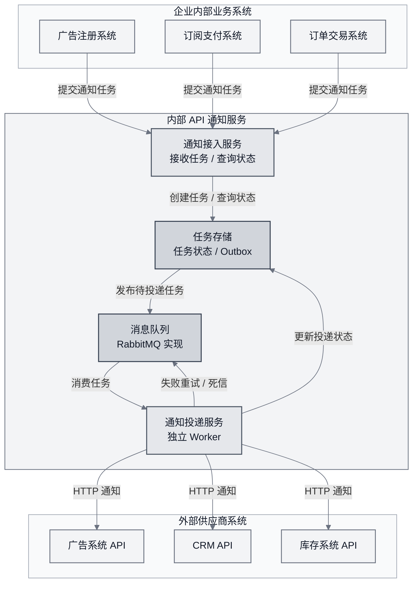
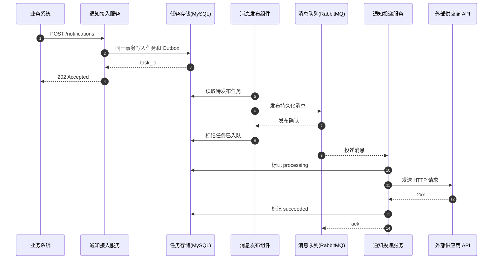
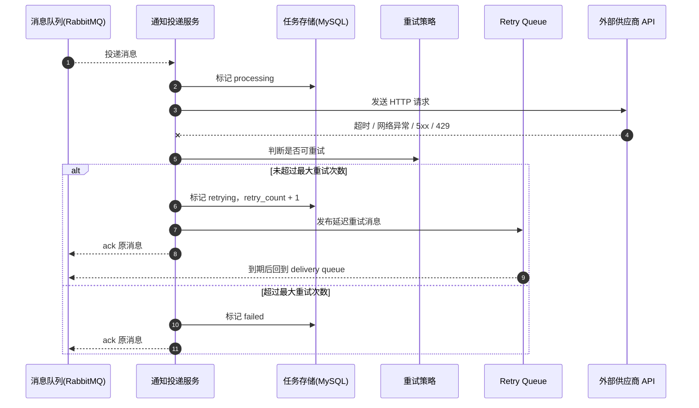

# rc_wujunqi

AI Coding 作业：API 通知系统设计与实现。

## 问题理解

这是一个面向企业内部业务系统的可靠异步通知任务系统 MVP。架构上拆分为通知接入、任务存储、消息队列和通知投递几个边界，其中通知投递服务是独立的消费任务系统，负责异步完成外部供应商 API 投递。

业务系统提交任务后不需要同步等待外部供应商的业务处理结果，只需要确认通知任务已经被接收和持久化。因此本系统不应设计成简单 HTTP 代理，而应设计成具备持久化、异步投递、失败重试、状态记录和幂等控制能力的任务系统。

## 核心判断

- 技术栈选择：Golang + MySQL + RabbitMQ。
- Go Web 层采用 MVC 风格分层：Controller、Service、Model、Repository、Worker。
- 业务边界：业务系统提交任务后不需要同步等待外部 API 返回业务结果；系统关注的是把通知任务尽可能稳定、可靠地送达目标地址。
- 投递语义：至少一次投递，不承诺 exactly once。
- 可靠性：MySQL 事务 + outbox + RabbitMQ durable queue + ack + retry queue + dead-letter。
- Outbox pattern 的作用：解决“任务已落库但 MQ 消息发布失败”的双写一致性问题。创建通知任务时，在同一个 MySQL 事务中写入任务和 outbox 事件；后台 publisher 再从 outbox 可靠发布到消息队列，进程重启后也能继续补偿未发布事件。
- 幂等：使用 `vendor + idempotency_key` 的 MySQL 唯一索引避免重复创建任务。
- 安全边界：MVP 不让业务请求直接传入外部 `target_url`，而是通过代码配置维护 `vendor` 对应的目标地址、方法和默认 Header，避免通知系统退化成任意 HTTP 转发器。
- 接入认证：MVP 为每个调用方分配 `app_id` 和 `app_secret`，请求通过 Header 携带签名信息，服务端按约定算法校验后才允许创建任务。
- 扩展性：将不同接入方的差异收敛到 `vendor` 配置和后续可插拔 adapter 层，任务落库、outbox、MQ、重试和状态机保持通用。
- MVP 边界：第一版聚焦可靠异步投递主链路，不做复杂供应商配置平台、请求模板化、管理后台 / 审计、复杂多租户体系等扩展能力。

## 系统边界

MVP 解决：

- 接收业务系统提交的通知任务。
- 校验调用方 `app_id`、时间戳、随机串和 HMAC 签名。
- 根据 `vendor` 从代码配置中解析目标地址、HTTP 方法和默认 Header。
- 将任务持久化到 MySQL。
- 通过 `vendor + idempotency_key` 保证任务创建幂等。
- 使用 outbox pattern 可靠发布消息到 RabbitMQ。
- 异步消费任务并调用外部 HTTP API。
- 对网络异常、超时、429、5xx 等可恢复失败进行延迟重试。
- 对不可重试失败或重试耗尽的任务记录最终失败状态。
- 提供任务状态查询。

MVP 不解决：

- 不保证 exactly once。外部 HTTP API 场景可能出现“请求已被处理但响应丢失”，低成本承诺 exactly once 不现实。
- 不判断外部供应商的业务语义是否真正成功，只以 HTTP 2xx 作为投递成功信号。
- 不提供复杂供应商配置平台、请求模板化、管理后台、审批和计费；MVP 先用代码配置文件承载接入方和供应商配置。
- 不做跨供应商工作流编排。

这些能力不是第一版可靠投递主链路的必要条件，过早加入会放大复杂度。

## 整体架构

图中的“消息队列”是架构抽象，本项目 MVP 使用 RabbitMQ 实现；“通知投递服务”在架构层面是独立 Worker 服务，负责消费任务并投递外部 API。当前 MVP 为降低部署复杂度，将通知接入、outbox publisher 和通知投递 consumer 暂时运行在同一个 Go 进程内；代码和职责边界按独立服务组织，后续可以快速拆分为单独的投递服务。



## 核心时序

### 成功投递



### 失败重试



## 可靠性与失败处理

系统采用至少一次投递语义。也就是说，系统会尽可能保证任务不丢、失败可重试、状态可追踪，但允许在异常场景下重复投递。业务系统或外部供应商如果需要进一步降低重复影响，应配合 `idempotency_key` 做幂等处理。

关键机制：

- API 接收任务后先落库，再异步投递；`202 Accepted` 只表示任务已被接收，不表示外部供应商已处理成功。
- 创建任务时，在同一个 MySQL 事务中写入 `notification_tasks` 和 `outbox_messages`，避免“任务已落库但 MQ 消息未发布”的双写不一致。
- Outbox publisher 后台扫描未发布事件，发布成功后标记 outbox published，并将任务状态更新为 `queued`。
- RabbitMQ 使用 durable queue、persistent message、consumer ack、retry queue 和 dead-letter queue。
- Consumer 成功更新任务状态后再 ack；如果 Consumer 崩溃，消息会重新投递。

失败分类：

| 场景 | 策略 |
| --- | --- |
| HTTP 2xx | 标记 `succeeded` |
| 网络异常 / 超时 | 标记 `retrying`，延迟重试 |
| HTTP 408 / 429 / 5xx | 标记 `retrying`，延迟重试 |
| HTTP 4xx，除 408 / 429 | 标记 `failed` |
| 超过最大重试次数 | 标记 `failed`，发布 dead-letter 事件 |

重试采用指数退避：

```text
delay = min(base_delay * 2 ^ retry_count, max_delay)
```

MVP 默认配置为 `base_delay = 30s`、`max_delay = 30min`、`max_retries = 5`。如果外部供应商长期不可用，任务会多次延迟重试；重试耗尽后进入 `failed`，保留最后错误、HTTP 状态码和重试次数，便于后续排查或人工重放。

## 关键工程决策与取舍

- 选择 Golang：通知系统包含 HTTP 服务、后台 publisher、consumer 和大量网络 IO，Go 的并发模型适合这类任务系统。
- 选择 MySQL：用事务保证 task 和 outbox 原子写入，用唯一索引处理幂等，降低第一版的数据基础设施复杂度。
- 选择 RabbitMQ：它适合业务异步任务队列，天然支持 ack、durable queue、retry queue、dead-letter 和消费端水平扩展。
- 采用 outbox pattern：比“写库后直接发 MQ”更可靠，可以在进程重启或 MQ 短暂不可用后继续补偿未发布事件。
- 采用至少一次投递：外部 HTTP API 无法低成本保证 exactly once，重复投递通过幂等键降低影响。
- 采用代码配置的供应商目标地址：MVP 中 `target_url` 不放在请求体里，避免调用方绕过系统边界向任意地址发起请求；后续再演进为数据库配置或管理后台。
- 采用 `app_id + app_secret` 的请求签名：在不引入完整账号体系和后台的前提下，先为内部调用方提供可落地的身份认证、权限边界和防重放能力。
- 未采用“只依赖 MySQL 任务表轮询完成投递”的方案：这种方案实现更轻，但削峰、失败隔离、消费确认和后续横向扩展能力弱于 MQ 方案。
- 未采用规则引擎、管理后台、复杂供应商配置平台、服务网格等方案：这些属于后续复杂度，不是 MVP 的主链路。

如果不使用 RabbitMQ，替代方案可以是“数据库任务表 + 定时扫描 worker + `next_retry_at` 调度”。这个方案更适合很低流量、部署条件受限的系统；本项目选择 RabbitMQ，是因为我们强调可靠投递，MQ 能更清晰地表达异步任务、失败隔离和重试语义。

## 安全与配置化改造计划

这部分是对 MVP 的主动收敛：通知系统应该是“按配置投递到已接入供应商”的任务系统，而不是让调用方在请求体里传入任意 `target_url` 的 HTTP 代理。

### 1. 供应商目标地址改为代码配置

MVP 暂时不做管理后台，也不把供应商配置放到数据库。先增加代码配置文件维护供应商能力，例如：

```go
type VendorProfile struct {
    Vendor         string
    TargetURL      string
    Method         string
    DefaultHeaders map[string]string
    MaxRetries     int
}
```

示例配置：

```go
var VendorProfiles = map[string]VendorProfile{
    "crm": {
        Vendor:    "crm",
        TargetURL: "http://mock-vendor:9000/ok",
        Method:    "POST",
        DefaultHeaders: map[string]string{
            "Content-Type": "application/json",
        },
        MaxRetries: 5,
    },
}
```

创建通知任务时，请求体只需要传 `vendor`、`payload`、`idempotency_key` 等业务字段。服务端根据 `vendor` 找到固定的 `target_url`、`method` 和默认 Header，再创建任务。

### 2. 调用方凭证和签名认证

为每个发送通知的内部系统分配一组凭证：

- `app_id`：调用方身份标识。
- `app_secret`：调用方和通知系统共享的签名密钥，只用于签名，不放在请求体中传输。
- `allowed_vendors`：该调用方允许投递的供应商列表。

MVP 可先用代码配置维护：

```go
type AppCredential struct {
    AppID          string
    AppSecret      string
    AllowedVendors []string
    Enabled        bool
}
```

每次请求需要携带 Header：

```text
X-App-Id: biz-payment
X-Timestamp: <current unix timestamp>
X-Nonce: <random string>
X-Signature: <hex hmac sha256 signature>
```

约定签名原文：

```text
HTTP_METHOD + "\n" +
REQUEST_PATH + "\n" +
X-App-Id + "\n" +
X-Timestamp + "\n" +
X-Nonce + "\n" +
SHA256(request_body)
```

签名算法：

```text
X-Signature = hex(HMAC_SHA256(app_secret, signing_string))
```

服务端校验流程：

1. 根据 `X-App-Id` 找到调用方配置，确认调用方启用。
2. 校验 `X-Timestamp` 在允许窗口内，例如 5 分钟。
3. 校验 `X-Nonce` 未被重复使用，MVP 可先使用进程内 TTL 缓存，后续演进为 Redis 或数据库。
4. 使用 `app_secret` 重新计算 HMAC-SHA256 签名，并用常量时间比较。
5. 校验该 `app_id` 是否允许投递请求体中的 `vendor`。
6. 校验通过后再进入创建任务逻辑。

### 3. 代码改造范围

本轮代码实现覆盖的主要位置：

| 文件 | 修改点 |
| --- | --- |
| `internal/config/config.go` 或新增 `internal/config/vendor_profiles.go` | 增加 `VendorProfile` 和静态供应商配置 |
| 新增 `internal/config/app_credentials.go` | 增加 `AppCredential`、`app_id`、`app_secret`、`allowed_vendors` 配置 |
| 新增 `internal/controller/auth_middleware.go` | 实现 Header 读取、签名校验、时间戳校验、nonce 防重放和权限校验 |
| `internal/controller/notification_controller.go` | 创建任务请求体移除 `target_url`、`method`、外部认证类 Header；从认证上下文读取 `app_id` |
| `internal/service/notification_service.go` | 根据 `vendor` 解析配置后的目标地址和方法，校验调用方是否允许访问该 `vendor` |
| `internal/model/notification_task_model.go` | 增加 `app_id` 字段，便于审计和按调用方隔离幂等 |
| `internal/infra/mysql/migration.sql` | 增加 `app_id` 列，并将唯一索引演进为 `app_id + vendor + idempotency_key` |
| `internal/repository/task_repository.go` | 持久化 `app_id`，查询和幂等判断纳入调用方维度 |
| 单元测试 | 覆盖签名成功、签名失败、时间戳过期、nonce 重放、无权访问 vendor、重复幂等请求 |

### 4. 实施顺序

1. 先加静态 `VendorProfile` 配置，并把创建任务 API 中的 `target_url` 移除。
2. 再加 `AppCredential` 配置和签名认证中间件。
3. 然后把 `app_id` 写入任务表，调整幂等唯一索引。
4. 最后补齐认证、权限、幂等和配置解析的测试用例。

## 扩展性设计

这个系统的扩展性重点不是一开始做一个大而全的供应商配置平台，而是先把稳定的通知任务主链路抽象出来：接收任务、持久化、发布 MQ、异步投递、失败重试、状态查询。这些能力和具体接入方无关，因此新增一家接入方时，优先复用同一套任务模型和投递链路。

当前 MVP 中，快速接入一家 HTTP 接入方只需要明确这些信息：

- `vendor`：接入方标识，用于查找代码配置中的目标地址、HTTP 方法、默认 Header、幂等隔离和查询统计。
- `payload`：本次通知的业务请求体。
- `idempotency_key`：由业务侧提供，用于避免同一接入方下重复创建同一通知任务。
- `max_retries`：允许按任务覆盖默认重试次数，后续可演进为接入方级重试策略。
- Header 中的 `app_id`、时间戳、随机串和签名：用于识别调用方、校验请求完整性，并限制调用方只能访问被授权的 `vendor`。

因此，如果新接入方的接口可以通过标准 HTTP POST / PUT / PATCH 表达，通常不需要改动 outbox、RabbitMQ、retry、状态机和 worker 主流程，只需要按约定提交一条新的通知任务即可。对于认证、签名、字段映射、固定 endpoint 等差异，后续可以按复杂度分阶段扩展：

- 轻量接入：在代码配置中增加 `vendor_profiles`，维护 endpoint、默认 headers、认证方式和默认重试策略，调用方只传业务 `payload`。
- 配置化接入：当供应商数量增加后，将代码配置演进为数据库配置或管理后台，维护 endpoint、默认 headers、认证方式、限流、并发度和默认重试策略。
- 适配器接入：为复杂接入方增加 `NotifierAdapter`，在投递前完成签名、模板渲染、字段转换或特殊响应判定；核心任务存储、MQ 和重试机制保持不变。
- 队列隔离：当某个接入方流量较大或稳定性较差时，可按 `vendor` 拆分队列、consumer 并发和限流策略，避免单个接入方影响整体投递能力。

快速接入一家的理想流程是：确认对方 API 契约，定义 `vendor` 和幂等键规则，准备请求模板或 adapter，联调用例覆盖成功、可重试失败、不可重试失败和重复请求，然后上线接入方级配置。这样新增接入方主要是配置和适配工作，而不是重写可靠投递主链路。

## 后续演进

- RabbitMQ 从单机演进为集群。
- Consumer 水平扩展，并按供应商设置并发度。
- 按供应商拆分队列，避免单个供应商故障影响其他通道。
- 增加供应商级限流、熔断、暂停投递和恢复投递能力。
- 将代码中的 `vendor_profiles` 和 `app_credentials` 演进为数据库配置或管理后台，沉淀 endpoint、认证、签名、默认 headers、默认重试策略和并发限制。
- 引入 `NotifierAdapter` 扩展点，支持需要签名、字段映射、模板渲染或特殊成功判定的复杂接入方。
- 增加 `delivery_attempts` 表，记录每次投递的请求时间、响应码和错误。
- 增加 failed / dead-letter 任务的人工重放能力。
- 增加 Prometheus 指标、日志追踪和告警。
- 当供应商数量和格式复杂度上升后，再引入更完整的供应商配置平台和请求模板管理。

## 快速启动

依赖：

- Docker / Docker Compose
- 本地运行测试需要 Go 1.25+

```bash
docker compose up --build
```

服务地址：

- API: `http://localhost:8080`
- Mock Vendor: `http://localhost:9000`
- RabbitMQ 管理台: `http://localhost:15672`，账号密码 `guest / guest`

健康检查：

```bash
curl http://localhost:8080/healthz
```

## 创建通知任务

```bash
curl -X POST http://localhost:8080/notifications \
  -H 'Content-Type: application/json' \
  -H 'X-App-Id: biz-payment' \
  -H 'X-Timestamp: <current-unix-timestamp>' \
  -H 'X-Nonce: <random-string>' \
  -H 'X-Signature: <hmac-sha256-signature>' \
  -d '{
    "vendor": "crm",
    "payload": {
      "contact_id": "c_123",
      "status": "paid"
    },
    "idempotency_key": "payment_evt_123"
  }'
```

返回示例：

```json
{
  "created": true,
  "status": "pending",
  "task_id": "ntf_xxx"
}
```

查询任务：

```bash
curl http://localhost:8080/notifications/{task_id}
```

## 本地测试

```bash
go test ./...
```

## 目录结构

```text
cmd/
  server/        # API 服务入口
  mockvendor/    # 本地 mock 外部供应商
internal/
  controller/    # MVC Controller
  service/       # 业务编排
  model/         # 任务和 outbox 模型
  domain/        # 状态和重试规则
  repository/    # MySQL 读写、事务、幂等
  worker/        # outbox publisher 和 delivery consumer
  infra/         # MySQL、RabbitMQ、HTTP client
AI使用说明.md   # AI 辅助过程、未采纳建议和自主决策说明
```

## AI 使用说明

详见 [AI使用说明.md](AI使用说明.md)。
