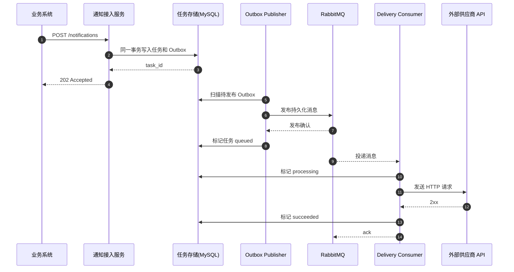
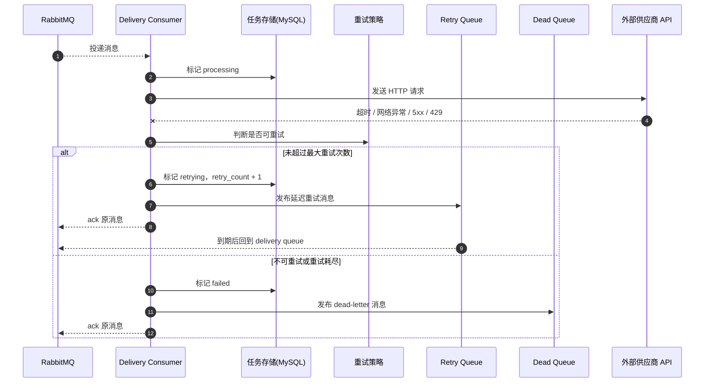
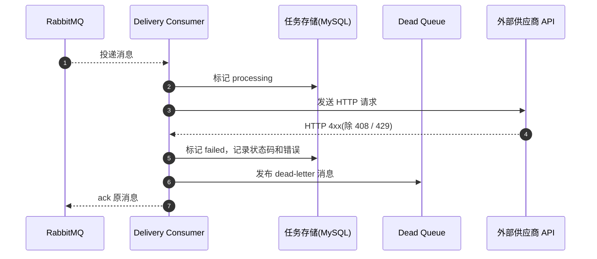
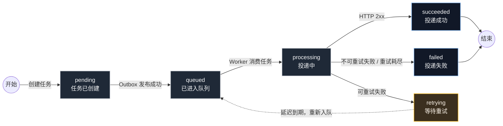

# rc_wujunqi

AI Coding 作业：API 通知系统设计与实现。

## 问题理解

这是一个面向企业内部业务系统的可靠异步通知任务系统 MVP。业务系统在关键事件发生后提交通知任务，但不需要同步等待外部供应商 API 的业务处理结果；它只需要确认任务已经被通知系统接收，并能在后台尽可能可靠地送达。

因此，本系统不应设计成简单 HTTP 代理，而应设计成任务系统：先接收、鉴权、持久化，再通过消息队列异步投递，并记录状态、失败原因和重试次数。

## 系统边界

MVP 解决：

- 接收业务系统提交的通知任务。
- 校验调用方 `app_id`、时间戳、随机串和 HMAC 签名。
- 根据 `vendor` 从 TOML 配置文件解析目标地址、HTTP 方法和默认 Header。
- 将任务和 outbox 事件持久化到 MySQL。
- 使用 `app_id + vendor + idempotency_key` 保证同一调用方下的任务创建幂等。
- 通过 RabbitMQ 异步投递外部 HTTP API。
- 对网络异常、超时、429、5xx 等可恢复失败进行延迟重试。
- 提供任务状态查询。

MVP 不解决：

- 不承诺 exactly once。外部 HTTP 场景可能出现“供应商已处理但响应丢失”，低成本保证 exactly once 不现实。
- 不判断供应商业务语义是否成功，只以 HTTP 2xx 作为投递成功信号。
- 不做供应商管理后台、复杂请求模板、审批计费、复杂多租户权限和跨供应商工作流编排。

## 整体架构

当前 MVP 为降低部署复杂度，将通知接入、outbox publisher 和通知投递 consumer 运行在同一个 Go 进程内；代码职责按独立服务边界组织，后续可以拆分为单独的投递服务。图中多个业务系统和供应商是扩展示意，当前代码内置 `biz-payment` 调用方和 `crm` 供应商用于演示主链路。


核心组件：

- API 接入层：负责鉴权、参数校验、任务创建和状态查询。
- MySQL：保存任务状态和 outbox 事件，利用事务保证任务与待发布事件原子写入。
- RabbitMQ：承载异步投递、消费确认、延迟重试和 dead-letter。
- Delivery Consumer：消费投递任务，调用外部供应商 API，并更新最终状态。

## 核心时序

### 成功投递



### 失败重试



### 不可重试失败



## 状态机



## 可靠性与失败处理

系统采用至少一次投递语义：优先保证任务不丢、失败可重试、状态可追踪，同时接受异常场景下可能重复投递。业务系统和外部供应商应配合 `idempotency_key` 降低重复通知影响。

关键机制：

- API 接收任务后先落库，再异步投递；`202 Accepted` 只表示任务已接收，不表示供应商已处理成功。
- 创建任务时，在同一个 MySQL 事务中写入 `notification_tasks` 和 `outbox_messages`，避免“任务已落库但 MQ 消息未发布”的双写不一致。
- Outbox publisher 扫描未发布事件，发布成功后标记 outbox published，并将任务状态更新为 `queued`。
- RabbitMQ 使用 durable queue、persistent message、consumer ack、retry queue 和 dead-letter queue。
- Consumer 成功更新任务状态后再 ack；如果 Consumer 崩溃，消息会重新投递。

失败策略：

| 场景 | 策略 |
| --- | --- |
| HTTP 2xx | 标记 `succeeded` |
| 网络异常 / 超时 | 延迟重试 |
| HTTP 408 / 429 / 5xx | 延迟重试 |
| HTTP 4xx，除 408 / 429 | 标记 `failed` |
| 超过最大重试次数 | 标记 `failed`，发布 dead-letter 消息 |

重试采用指数退避，默认 `base_delay = 30s`、`max_delay = 30min`、`max_retries = 5`。

## 关键工程决策与取舍

- 选择 Golang：系统包含 HTTP 服务、后台 publisher、consumer 和大量网络 IO，Go 的并发模型适合这类异步任务系统。
- 选择 MySQL：用事务保证 task 和 outbox 原子写入，用唯一索引处理幂等，降低第一版数据基础设施复杂度。
- 选择 RabbitMQ：它适合业务任务队列，提供 ack、durable queue、retry queue、dead-letter 和消费端水平扩展能力。不使用 RabbitMQ 时，替代方案是“数据库任务表 + 定时扫描 worker + `next_retry_at` 调度”，实现更轻但削峰、确认和失败隔离能力更弱。
- 采用 outbox pattern：比“写库后直接发 MQ”更可靠，可以在进程重启或 MQ 短暂不可用后继续补偿未发布事件。
- 采用至少一次投递：外部 HTTP API 无法低成本保证 exactly once，重复投递通过 `idempotency_key` 和供应商侧幂等能力降低影响。
- 不让调用方传 `target_url`：供应商目标地址、方法和默认 Header 由 `config/vendor_profiles.toml` 维护，避免通知系统变成任意 HTTP 转发器，也便于后续配置和代码分开上线。
- 采用 `app_id + app_secret` 签名认证：在不引入完整账号体系的前提下，先提供调用方身份识别、请求防篡改、防重放和 vendor 授权边界。
- 不做规则引擎、管理后台、复杂供应商配置平台和服务网格：这些能力会放大 MVP 复杂度，不属于可靠投递主链路。

## 后续演进

- RabbitMQ 从单机演进为集群，Consumer 水平扩展。
- 按 `vendor` 拆分队列、并发度和限流策略，隔离单个供应商故障。
- 将 TOML 中的 `vendor_profiles` 和代码中的 `app_credentials` 演进为数据库配置或管理后台。
- 引入 `NotifierAdapter`，支持供应商签名、字段映射、模板渲染或特殊成功判定。
- 增加 `delivery_attempts` 表、人工重放、Prometheus 指标、日志追踪和告警。

## 快速启动

依赖：

- Docker / Docker Compose
- 本地运行测试需要 Go 1.25+

```bash
docker compose up --build
```

服务地址：

- API: `http://localhost:8080`
- Mock Vendor: `http://localhost:9000`
- RabbitMQ 管理台: `http://localhost:15672`，账号密码 `guest / guest`

默认供应商配置文件为 `config/vendor_profiles.toml`，可通过 `VENDOR_PROFILES_PATH` 指定不同环境的配置文件。

```bash
curl http://localhost:8080/healthz
go test ./...
```

创建任务请求体示例：

```json
{
  "vendor": "crm",
  "payload": {
    "contact_id": "c_123",
    "status": "paid"
  },
  "idempotency_key": "payment_evt_123"
}
```

接口请求需要携带 `X-App-Id`、`X-Timestamp`、`X-Nonce`、`X-Signature`，签名算法见 `internal/controller/auth_middleware.go`。

## AI 使用说明

详见 [AI使用说明.md](AI使用说明.md)。
