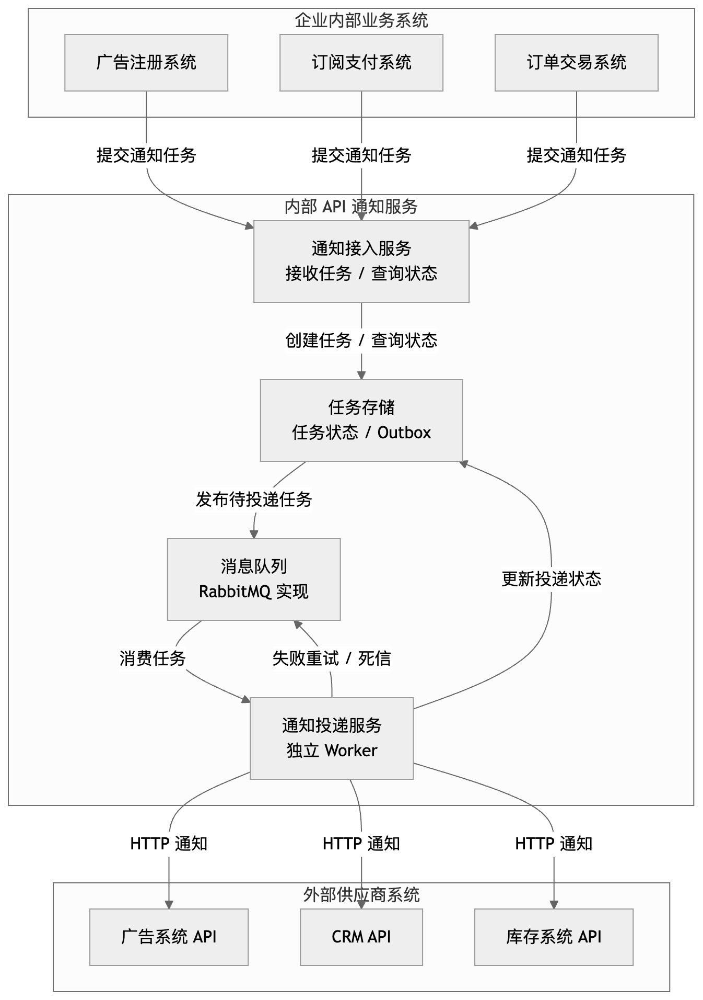
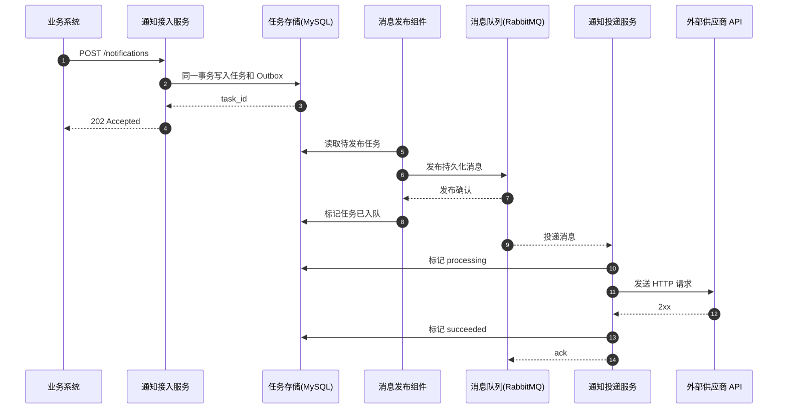
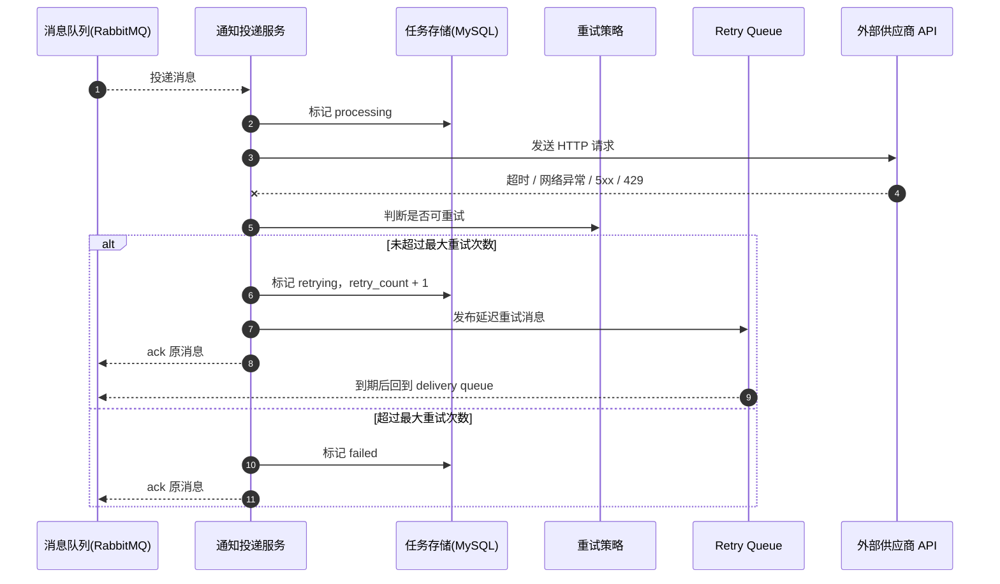

# rc_wujunqi

AI Coding 作业：API 通知系统设计与实现。

这是一个内部 API 通知服务 MVP。系统接收业务系统提交的外部 HTTP 通知任务，先持久化到 MySQL，再通过 outbox pattern 可靠发布到 RabbitMQ，由 Go consumer 异步投递到外部供应商 API。

## 核心判断

- 技术栈选择：Golang + MySQL + RabbitMQ。
- Go Web 层采用 MVC 风格分层：Controller、Service、Model、Repository、Worker。
- 投递语义：至少一次投递，不承诺 exactly once。
- 可靠性：MySQL 事务 + outbox + RabbitMQ durable queue + ack + retry queue + dead-letter。
- 幂等：使用 `vendor + idempotency_key` 的 MySQL 唯一索引避免重复创建任务。

## 整体架构

图中的“消息队列”是架构抽象，本项目 MVP 使用 RabbitMQ 实现；“通知投递服务”在架构层面是独立 Worker 服务，负责消费任务并投递外部 API。



## 核心时序

### 成功投递



### 失败重试



## 快速启动

依赖：

- Docker / Docker Compose
- 本地运行测试需要 Go 1.25+

```bash
docker compose up --build
```

服务地址：

- API: `http://localhost:8080`
- Mock Vendor: `http://localhost:9000`
- RabbitMQ 管理台: `http://localhost:15672`，账号密码 `guest / guest`

健康检查：

```bash
curl http://localhost:8080/healthz
```

## 创建通知任务

```bash
curl -X POST http://localhost:8080/notifications \
  -H 'Content-Type: application/json' \
  -d '{
    "vendor": "crm",
    "target_url": "http://mock-vendor:9000/ok",
    "method": "POST",
    "headers": {
      "Content-Type": "application/json"
    },
    "payload": {
      "contact_id": "c_123",
      "status": "paid"
    },
    "idempotency_key": "payment_evt_123"
  }'
```

返回示例：

```json
{
  "created": true,
  "status": "pending",
  "task_id": "ntf_xxx"
}
```

查询任务：

```bash
curl http://localhost:8080/notifications/{task_id}
```

## 本地测试

```bash
go test ./...
```

## 目录结构

```text
cmd/
  server/        # API 服务入口
  mockvendor/    # 本地 mock 外部供应商
internal/
  controller/    # MVC Controller
  service/       # 业务编排
  model/         # 任务和 outbox 模型
  domain/        # 状态和重试规则
  repository/    # MySQL 读写、事务、幂等
  worker/        # outbox publisher 和 delivery consumer
  infra/         # MySQL、RabbitMQ、HTTP client
doc/
  需要理解.md
  需求分析.md
  架构图.md
  设计文档.md
  接口文档.md
  AI使用说明.md
```

## 文档入口

- [需要理解.md](doc/需要理解.md)
- [需求分析.md](doc/需求分析.md)
- [架构图.md](doc/架构图.md)
- [设计文档.md](doc/设计文档.md)
- [接口文档.md](doc/接口文档.md)
- [AI使用说明.md](doc/AI使用说明.md)
