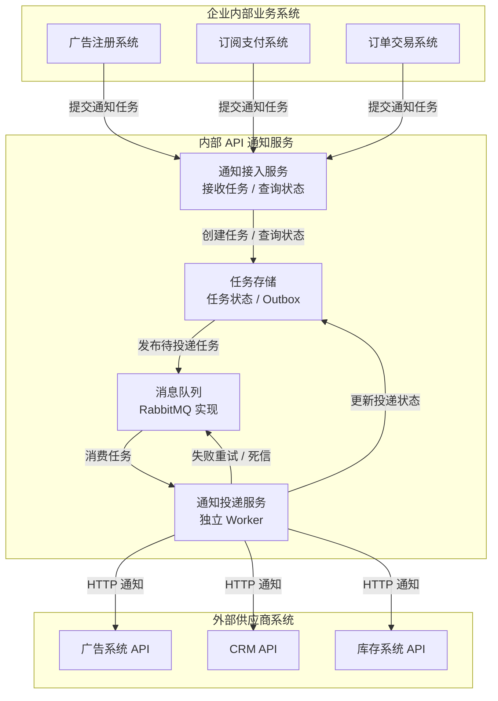
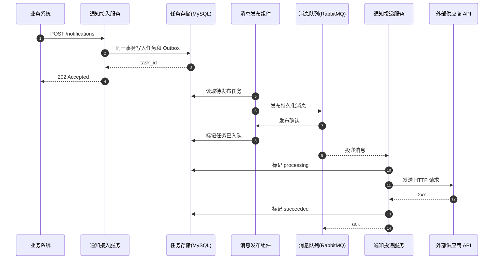
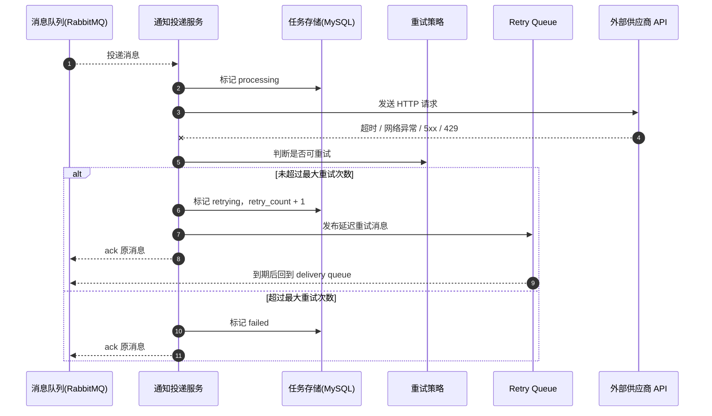
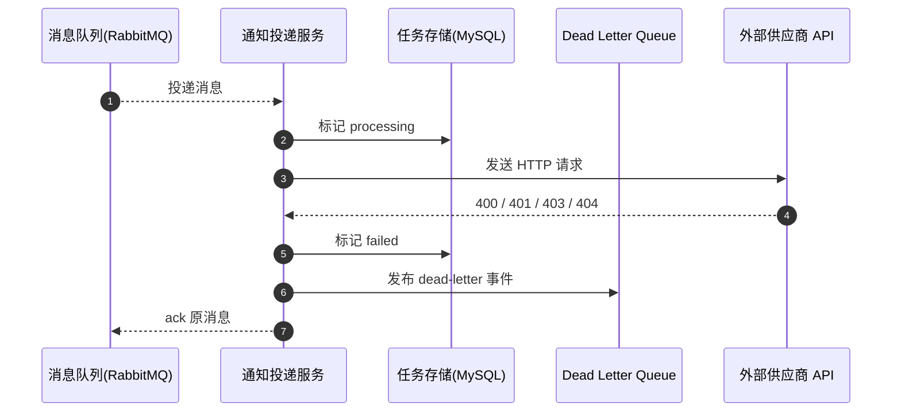
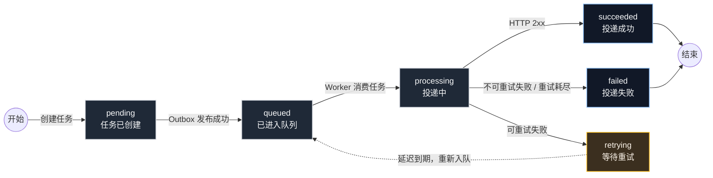

# 架构图

本文档集中维护 API 通知系统的 Mermaid 图。该文档是面试者主动补充的，用来让整体架构、投递流程、失败重试和状态流转更容易被评审快速理解。

## 整体架构

说明：图中的“消息队列”是架构抽象，本项目 MVP 使用 RabbitMQ 实现；“通知投递服务”在架构层面是独立 Worker 服务，负责消费任务并投递外部 API。

## 成功投递时序

## 失败重试时序

## 不可重试失败时序

## 状态机

